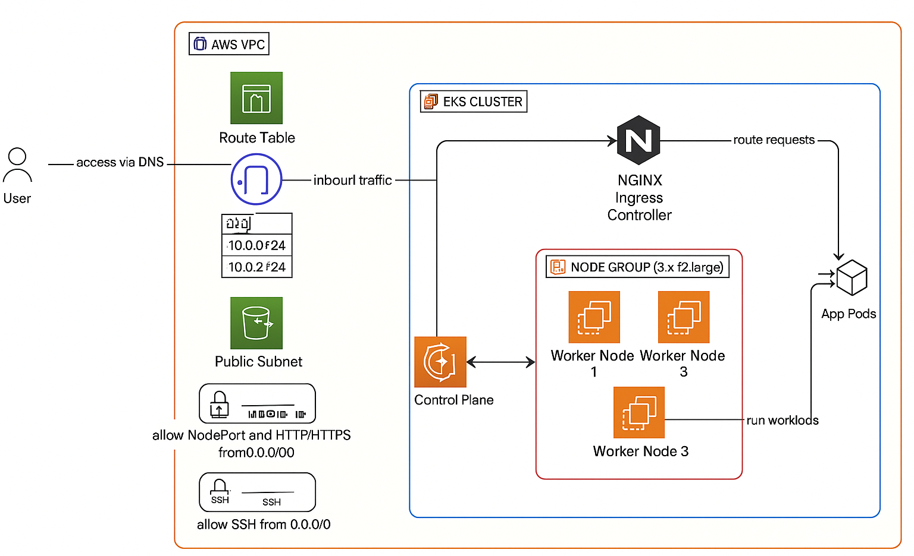
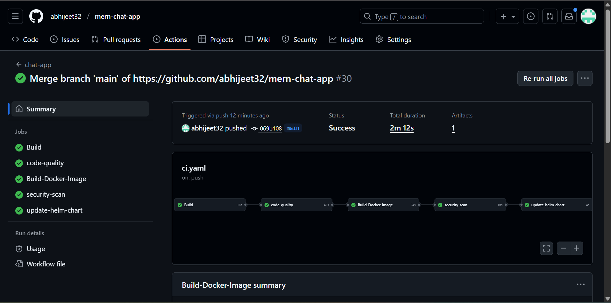
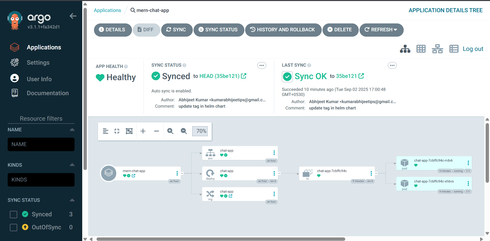
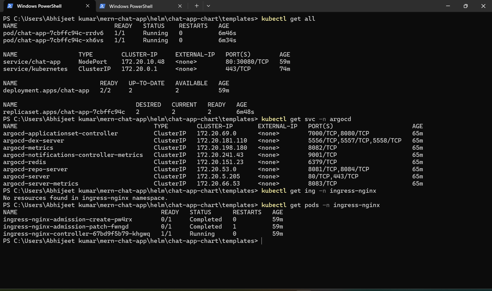

# mern-chat-app
A real-time chat application built using mern stack (MongoDB, Express.js, React, Node.js) and deployed on AWS using modern DevOps practices.

### Setup .env file
```js
PORT=...
MONGO_DB_URI=...
JWT_SECRET=...
NODE_ENV=...
```

### Build the app locally
```shell
npm run build
```

### Start the app
```shell
npm start
```

## Infrastructure Overview
This project uses the following AWS resources:
- **VPC** with public subnets
- **Internet Gateway** and route tables for public access
- **EKS Cluster** provisioned via Terraform
- **Managed Node Group** (3 x t2.large worker nodes)
- **NGINX Ingress Controller** deployed for routing
- **NodePort Service** for Kubernetes workloads
- **Security Groups** Allowing HTTP/HTTPS, NodePort, and SSH access

## Architecture Diagram


## Tech Stack
- **Frontend**: React.js
- **Backend**: Node.js, Express.js
- **Database**: MongoDB Atlas
- **Infrastructure**: Terraform
- **Containerization**: Docker
- **Orchestration**: Kubernetes
- **CI/CD**: GitHub Actions & ArgoCD
- **Cloud**: AWS
- **Routing**: NGINX Ingress

## Pull the Docker Image
```shell
docker pull abhi0874/chatapp-multistage:v1
```
## GitHub Actions CI


## ArgoCD


## Kubernetes Resources


